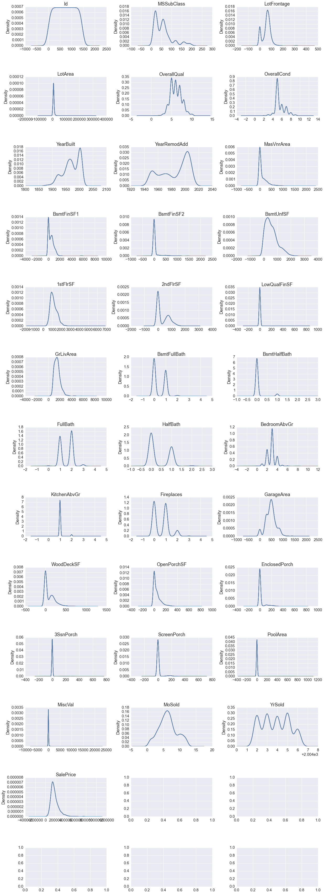
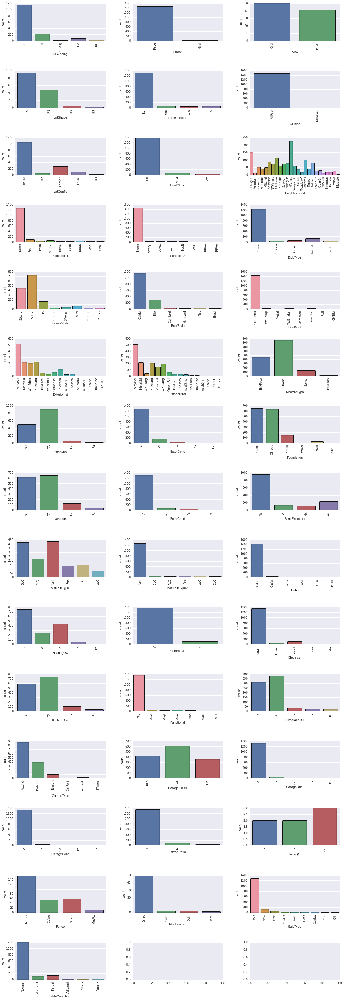
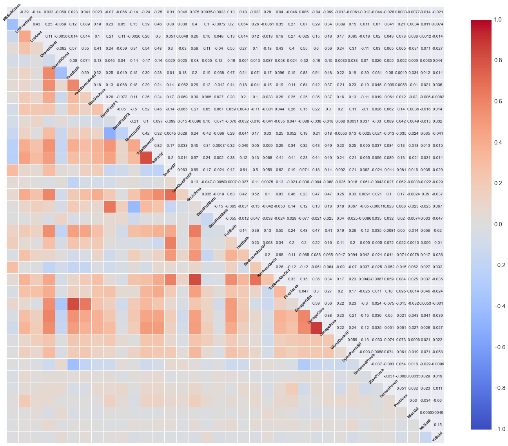
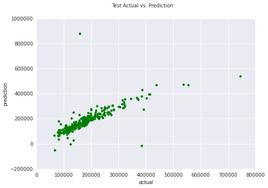
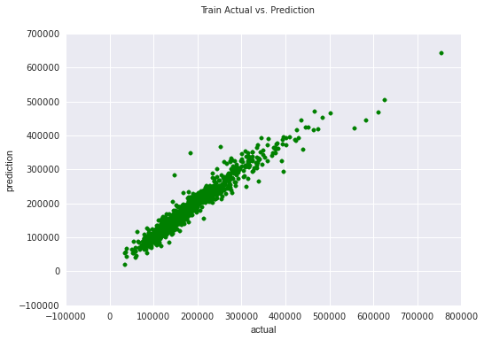
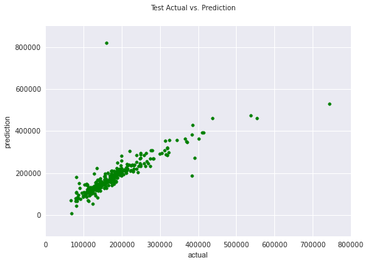
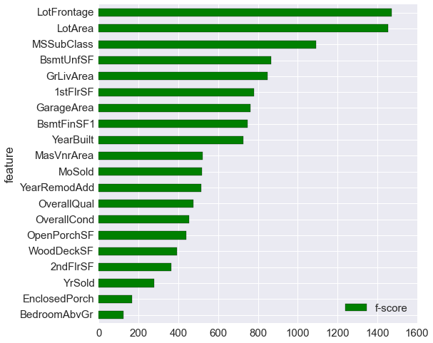
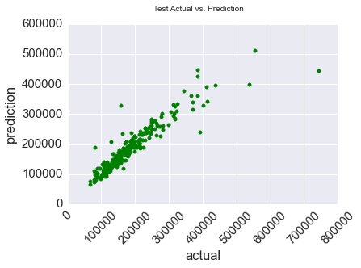

The objective of this notebook is to analyze Ames Housing data and use several regression models to predict house prices.

The data contains almost every feature of a house in Ames, Iowa. The features consist of the number of bedrooms, location, surroundings, etc. The data is from Kaggle's Housing Prices: Advanced Regression Techniques. It comes with a train set, test set, and data dictionary. (link below).

Steps to accomplish the objective:

1. Import data
2. Exploratory analysis
3. Data cleaning
4. Machine learning


# Import Data


```python
import os
import pandas as pd
import numpy as np
import scipy as sp
import warnings
warnings.filterwarnings('ignore')

train = pd.read_csv("train.csv")
test = pd.read_csv("test.csv")
```

# Exploratory Analysis

Quick look at data


```python
print train.head(10)
print train.shape
```

       Id  MSSubClass MSZoning  LotFrontage  LotArea Street Alley LotShape  \
    0   1          60       RL         65.0     8450   Pave   NaN      Reg   
    1   2          20       RL         80.0     9600   Pave   NaN      Reg   
    2   3          60       RL         68.0    11250   Pave   NaN      IR1   
    3   4          70       RL         60.0     9550   Pave   NaN      IR1   
    4   5          60       RL         84.0    14260   Pave   NaN      IR1   
    5   6          50       RL         85.0    14115   Pave   NaN      IR1   
    6   7          20       RL         75.0    10084   Pave   NaN      Reg   
    7   8          60       RL          NaN    10382   Pave   NaN      IR1   
    8   9          50       RM         51.0     6120   Pave   NaN      Reg   
    9  10         190       RL         50.0     7420   Pave   NaN      Reg   
    
      LandContour Utilities    ...     PoolArea PoolQC  Fence MiscFeature MiscVal  \
    0         Lvl    AllPub    ...            0    NaN    NaN         NaN       0   
    1         Lvl    AllPub    ...            0    NaN    NaN         NaN       0   
    2         Lvl    AllPub    ...            0    NaN    NaN         NaN       0   
    3         Lvl    AllPub    ...            0    NaN    NaN         NaN       0   
    4         Lvl    AllPub    ...            0    NaN    NaN         NaN       0   
    5         Lvl    AllPub    ...            0    NaN  MnPrv        Shed     700   
    6         Lvl    AllPub    ...            0    NaN    NaN         NaN       0   
    7         Lvl    AllPub    ...            0    NaN    NaN        Shed     350   
    8         Lvl    AllPub    ...            0    NaN    NaN         NaN       0   
    9         Lvl    AllPub    ...            0    NaN    NaN         NaN       0   
    
      MoSold YrSold  SaleType  SaleCondition  SalePrice  
    0      2   2008        WD         Normal     208500  
    1      5   2007        WD         Normal     181500  
    2      9   2008        WD         Normal     223500  
    3      2   2006        WD        Abnorml     140000  
    4     12   2008        WD         Normal     250000  
    5     10   2009        WD         Normal     143000  
    6      8   2007        WD         Normal     307000  
    7     11   2009        WD         Normal     200000  
    8      4   2008        WD        Abnorml     129900  
    9      1   2008        WD         Normal     118000  
    
    [10 rows x 81 columns]
    (1460, 81)


Check if test columns equal train columns and they do.


```python
test.columns == train.columns[:-1]
```


    array([ True,  True,  True,  True,  True,  True,  True,  True,  True,
            True,  True,  True,  True,  True,  True,  True,  True,  True,
            True,  True,  True,  True,  True,  True,  True,  True,  True,
            True,  True,  True,  True,  True,  True,  True,  True,  True,
            True,  True,  True,  True,  True,  True,  True,  True,  True,
            True,  True,  True,  True,  True,  True,  True,  True,  True,
            True,  True,  True,  True,  True,  True,  True,  True,  True,
            True,  True,  True,  True,  True,  True,  True,  True,  True,
            True,  True,  True,  True,  True,  True,  True,  True], dtype=bool)


Look at the data types. Object has the highest count.


```python
train.dtypes.value_counts()
```


    object     43
    int64      35
    float64     3
    dtype: int64


Density plots for the numeric features. There does not seem to be anything out of the ordinary.

Some interesting facts:
- most homes were built in year 2000
- most homes have about 1000 sqft for the 1st floor
- most homes sold for under $200,000


```python
import matplotlib.pyplot as plt
%matplotlib inline

train.select_dtypes(include=['float64','int64'])
# num_features = train.dtypes[train.dtypes in ['int64','float64']].index
n_features1 = 10
n_rows = 13
num_df = train.select_dtypes(include=['float64','int64'])

fig, axs = plt.subplots(n_rows,3, figsize = (20,60))

fig.subplots_adjust(hspace=.8, wspace=.3)

for k in axs:
    for i,j in zip(num_df, axs.flat):
        g = num_df[i].plot.kde(ax = j, title = i)
        g.get_xaxis().tick_bottom()
        g.get_yaxis().tick_left()
```





Same as before but bar plots for categorical features. Interesting facts:

- Most homes are in North Ames
- The ones with garages are attached to the house
- Most are normal sales


```python
import seaborn as sns
#object features
object_features = train.dtypes[train.dtypes == 'object'].index
n_features1 = 10
n_rows = 15
object_df = train[object_features]

fig, axs = plt.subplots(n_rows,3, figsize = (20,60))

fig.subplots_adjust(hspace=.8, wspace=.3)


for k in axs:
    for i,j in zip(object_features, axs.flat):
        g = sns.countplot(x=i, data=object_df, ax=j)
        plt.setp(j.get_xticklabels(), rotation=90)
```





Let's check out the correlation each numeric feature has with the target (SalePrice). OverallQual has the highest
correlation with .79 and BsmtFinSF2 has lowest with 0.11.


```python
numeric_features = train.dtypes[train.dtypes != 'object'].index
pearson = train[numeric_features].corr(method='pearson')
corr_with_target = pearson.ix[-1][1:-1]
corr_with_target = corr_with_target[abs(corr_with_target).argsort()[::-1]]
print corr_with_target
```

    OverallQual      0.790982
    GrLivArea        0.708624
    GarageCars       0.640409
    GarageArea       0.623431
    TotalBsmtSF      0.613581
    1stFlrSF         0.605852
    FullBath         0.560664
    TotRmsAbvGrd     0.533723
    YearBuilt        0.522897
    YearRemodAdd     0.507101
    GarageYrBlt      0.486362
    MasVnrArea       0.477493
    Fireplaces       0.466929
    BsmtFinSF1       0.386420
    LotFrontage      0.351799
    WoodDeckSF       0.324413
    2ndFlrSF         0.319334
    OpenPorchSF      0.315856
    HalfBath         0.284108
    LotArea          0.263843
    BsmtFullBath     0.227122
    BsmtUnfSF        0.214479
    BedroomAbvGr     0.168213
    KitchenAbvGr    -0.135907
    EnclosedPorch   -0.128578
    ScreenPorch      0.111447
    PoolArea         0.092404
    MSSubClass      -0.084284
    OverallCond     -0.077856
    MoSold           0.046432
    3SsnPorch        0.044584
    YrSold          -0.028923
    LowQualFinSF    -0.025606
    MiscVal         -0.021190
    BsmtHalfBath    -0.016844
    BsmtFinSF2      -0.011378
    Name: SalePrice, dtype: float64


Let's check the correlation between each feature.
There are some features that have high correlation:

- TotalBsmtSF and 1stFlrSF have .82 correlation
- YearBuilt and GarageYrBlt have .83 correlation
- GrLivArea and TotRmsAbvGrd have .83 correlation
- GarageCars and GarageArea have .88 correlation
- BsmtFinSF2 and BsmtUntSF have -.5 correlation highest negative


```python
# make a plot of specified dimension (in inches), just a 1x1 subplot
fig, ax = plt.subplots(figsize=(25, 25))
# pass the axis to draw on
sns.corrplot(train[numeric_features[1:-1]], ax=ax)
```


    <matplotlib.axes._subplots.AxesSubplot at 0x10d531110>





# Data Cleaning

Begin with removing features that have multi-collinearity. Out of the 4 pairs, remove 1 from each pair.


```python
mc_columns = ['TotalBsmtSF', 'GarageYrBlt','TotRmsAbvGrd','GarageCars']
train.drop(mc_columns, axis = 1, inplace = True)
test.drop(mc_columns, axis = 1, inplace = True)
```

The following counts the nulls in each feature for train and test set. There are some features with greater than 90% null.


```python
# columns with NAs and count
from __future__ import division
print "Train Columns with Nulls \n"
train_nulls = []
for column in train.columns:
    if train[column].isnull().sum() > 0:
        print "Column: %s has %d nulls which is %s%%" \
        %(column, train[column].isnull().sum(), round(train[column].isnull().sum()/len(train),2)*100)
        train_nulls.append(column)
        
#test
test_nulls = []
print "\nTest Columns with Nulls \n"
for column in test.columns:
    if test[column].isnull().sum() > 0:
        print "Column: %s has %d nulls which is %s%%" \
        %(column, test[column].isnull().sum(), round(test[column].isnull().sum()/len(test),2)*100.0)
        test_nulls.append(column)
```

    Train Columns with Nulls 
    
    Column: LotFrontage has 259 nulls which is 18.0%
    Column: Alley has 1369 nulls which is 94.0%
    Column: MasVnrType has 8 nulls which is 1.0%
    Column: MasVnrArea has 8 nulls which is 1.0%
    Column: BsmtQual has 37 nulls which is 3.0%
    Column: BsmtCond has 37 nulls which is 3.0%
    Column: BsmtExposure has 38 nulls which is 3.0%
    Column: BsmtFinType1 has 37 nulls which is 3.0%
    Column: BsmtFinType2 has 38 nulls which is 3.0%
    Column: Electrical has 1 nulls which is 0.0%
    Column: FireplaceQu has 690 nulls which is 47.0%
    Column: GarageType has 81 nulls which is 6.0%
    Column: GarageFinish has 81 nulls which is 6.0%
    Column: GarageQual has 81 nulls which is 6.0%
    Column: GarageCond has 81 nulls which is 6.0%
    Column: PoolQC has 1453 nulls which is 100.0%
    Column: Fence has 1179 nulls which is 81.0%
    Column: MiscFeature has 1406 nulls which is 96.0%
    
    Test Columns with Nulls 
    
    Column: MSZoning has 4 nulls which is 0.0%
    Column: LotFrontage has 227 nulls which is 16.0%
    Column: Alley has 1352 nulls which is 93.0%
    Column: Utilities has 2 nulls which is 0.0%
    Column: Exterior1st has 1 nulls which is 0.0%
    Column: Exterior2nd has 1 nulls which is 0.0%
    Column: MasVnrType has 16 nulls which is 1.0%
    Column: MasVnrArea has 15 nulls which is 1.0%
    Column: BsmtQual has 44 nulls which is 3.0%
    Column: BsmtCond has 45 nulls which is 3.0%
    Column: BsmtExposure has 44 nulls which is 3.0%
    Column: BsmtFinType1 has 42 nulls which is 3.0%
    Column: BsmtFinSF1 has 1 nulls which is 0.0%
    Column: BsmtFinType2 has 42 nulls which is 3.0%
    Column: BsmtFinSF2 has 1 nulls which is 0.0%
    Column: BsmtUnfSF has 1 nulls which is 0.0%
    Column: BsmtFullBath has 2 nulls which is 0.0%
    Column: BsmtHalfBath has 2 nulls which is 0.0%
    Column: KitchenQual has 1 nulls which is 0.0%
    Column: Functional has 2 nulls which is 0.0%
    Column: FireplaceQu has 730 nulls which is 50.0%
    Column: GarageType has 76 nulls which is 5.0%
    Column: GarageFinish has 78 nulls which is 5.0%
    Column: GarageArea has 1 nulls which is 0.0%
    Column: GarageQual has 78 nulls which is 5.0%
    Column: GarageCond has 78 nulls which is 5.0%
    Column: PoolQC has 1456 nulls which is 100.0%
    Column: Fence has 1169 nulls which is 80.0%
    Column: MiscFeature has 1408 nulls which is 97.0%
    Column: SaleType has 1 nulls which is 0.0%


Let's narrow the columns down to at least 70% nulls. The train columns are equal to test columns. The percentages are about the same. Alley, PoolQC, Fence, and MiscFeature have a high percentage of nulls which means there is a lot of missing data. It is probably ok to drop these columns.


```python
limit = .70
#train
train_nulls_less_70 = []
train_remove = []
print "Train Columns with Nulls > 70%\n"
for column in train_nulls:
    if float(train[column].isnull().sum()/len(train)) > limit:
        print "Column: %s has %d nulls which is %s%%" \
        %(column, train[column].isnull().sum(), round(train[column].isnull().sum()/len(train),2)*100)
        train_remove.append(column)
    else:
        train_nulls_less_70.append(column)
        
#test
test_nulls_less_70 = []
test_remove = []
print "\nTest Columns with Nulls > 70%\n"
for column in test_nulls:
    if float(test[column].isnull().sum()/len(test)) > limit:
        print "Column: %s has %d nulls which is %s%%" \
        %(column, test[column].isnull().sum(), round(test[column].isnull().sum()/len(test),2)*100.0)
        test_remove.append(column)
    else:
        test_nulls_less_70.append(column)
```

    Train Columns with Nulls > 70%
    
    Column: Alley has 1369 nulls which is 94.0%
    Column: PoolQC has 1453 nulls which is 100.0%
    Column: Fence has 1179 nulls which is 81.0%
    Column: MiscFeature has 1406 nulls which is 96.0%
    
    Test Columns with Nulls > 70%
    
    Column: Alley has 1352 nulls which is 93.0%
    Column: PoolQC has 1456 nulls which is 100.0%
    Column: Fence has 1169 nulls which is 80.0%
    Column: MiscFeature has 1408 nulls which is 97.0%


This will remove the features with at least 70% null.


```python
train.drop(train_remove, axis = 1, inplace = True)
test.drop(test_remove, axis = 1, inplace = True)
```

Here I impute the nulls. There were categorical features that had a category "None" so I assumed the nulls were suppose to be "None" or 0 if numeric. Electrical is true null because it does not have the category "None". A true null is when the value is truly unknown and cannot be assumed.


```python
print train_nulls_less_70
#Electrical null is not part of factors
train_columns_true_null = {'Electrical':['Utilities','YearBuilt','Heating','HeatingQC','CentralAir']}
train_columns_null = [item for item in train_nulls_less_70 if item not in train_columns_true_null.keys()]
```

    ['LotFrontage', 'MasVnrType', 'MasVnrArea', 'BsmtQual', 'BsmtCond', 'BsmtExposure', 'BsmtFinType1', 'BsmtFinType2', 'Electrical', 'FireplaceQu', 'GarageType', 'GarageFinish', 'GarageQual', 'GarageCond']


Impute nulls in train set


```python
for column in train_columns_null:
    if train[column].dtype == 'float64':
        train.ix[train[column].isnull(), column] = 0
    else:
        train.ix[train[column].isnull(), column] = 'None'
```

Let's find the test features that are true nulls and regular nulls. There are 6 true null features which we will deal with later.


```python
print test_nulls_less_70
#null not part of factors
test_columns_true_null = {'MSZoning':['LotShape','LandContour','LandSlope','Neighborhood'],
                          'Utilities':['YearBuilt','Heating','HeatingQC','CentralAir'],
                          'Exterior1st':['RoofStyle','MasVnrType','Foundation'],
                          'Exterior2nd':['RoofStyle','MasVnrType','Foundation'],
                          'KitchenQual':['OverallQual','OverallCond','Functional'],
                          'Functional':['KitchenQual','OverallQual','OverallCond']}
test_columns_null = [item for item in test_nulls_less_70 if item not in test_columns_true_null.keys()]
#SaleType (change to Other)
```

    ['MSZoning', 'LotFrontage', 'Utilities', 'Exterior1st', 'Exterior2nd', 'MasVnrType', 'MasVnrArea', 'BsmtQual', 'BsmtCond', 'BsmtExposure', 'BsmtFinType1', 'BsmtFinSF1', 'BsmtFinType2', 'BsmtFinSF2', 'BsmtUnfSF', 'BsmtFullBath', 'BsmtHalfBath', 'KitchenQual', 'Functional', 'FireplaceQu', 'GarageType', 'GarageFinish', 'GarageArea', 'GarageQual', 'GarageCond', 'SaleType']


Impute nulls in test set.


```python
# replace the test null columns
for column in test_columns_null:
    if test[column].dtype == 'float64':
        test.ix[test[column].isnull(), column] = 0
    elif column == 'SaleType':
        test.ix[test[column].isnull(), column] = 'Oth'
    else:
        test.ix[test[column].isnull(), column] = 'None'
```

### Find True Nulls and Replace
The function below replaces the nulls values that are not part of the column's categories. For example Electrical has the following categories:

    SBrkr	Standard Circuit Breakers & Romex
    FuseA	Fuse Box over 60 AMP and all Romex wiring (Average)	
    FuseF	60 AMP Fuse Box and mostly Romex wiring (Fair)
    FuseP	60 AMP Fuse Box and mostly knob & tube wiring (poor)
    Mix	Mixed

a regular null will be just be a missing data point. We will find columns relevant to the null value's column in question. We will take the values for the relevant columns associated with the null value and find existing observations with the same values. If they are match I will record it and in the end take the value with the most occurences and set the null value as it.


```python
def find_nulls_and_similar_then_replace(df, null_column, rel_columns):
    #try to find similar obsverations like null MSZoning
    null_values = df[df[null_column].isnull()]\
    [rel_columns].values

    num_nulls = len(null_values) #number of nulls
    num_rel_columns = len(rel_columns) #number of relevant columns

    not_null_values = df[df[null_column].notnull()]\
    [rel_columns]

    similar_values = {sec : [] for sec in range(0,num_nulls)}#index of similar no null values to null values

    for key, values in enumerate(null_values):
        for index, row in not_null_values.iterrows(): #iterate over all rows
            if (row.values == values).sum() >= (num_rel_columns - 1): #if greater than equal to num_rel_columns - 1 
                similar_values[key].append(df.ix[index,null_column]) #append to list

    replace_nulls(df, null_column, similar_values)
```


```python
from collections import Counter

def replace_nulls(df, column, similar_values):
    
    most_common_value = []
    
    for key in similar_values:
        most_common_value.append(Counter(similar_values[key]).most_common(1)[0][0]) #most common value is appended to list

    df.ix[df[column].isnull(),column] = most_common_value #replace nulls
```

Apply find_nulls_and_similar_then_replace on train set.


```python
#Train
for key, value in train_columns_true_null.iteritems():
    find_nulls_and_similar_then_replace(train,key,value)
```

Apply find_nulls_and_similar_then_replace on train set.


```python
#Test
for key, value in test_columns_true_null.iteritems():
    find_nulls_and_similar_then_replace(test,key,value)
```

Sanity check to see if it worked, which it did!


```python
print train.isnull().values.any()
print test.isnull().values.any()
```

    False
    False


Reassigning the features and response variable, and checking if train features equal test features.


```python
#reset the x y variables
train_x = train.ix[:,:-1]
train_y = train.ix[:,-1]

train_x.columns == test.columns #check columns
```


    array([ True,  True,  True,  True,  True,  True,  True,  True,  True,
            True,  True,  True,  True,  True,  True,  True,  True,  True,
            True,  True,  True,  True,  True,  True,  True,  True,  True,
            True,  True,  True,  True,  True,  True,  True,  True,  True,
            True,  True,  True,  True,  True,  True,  True,  True,  True,
            True,  True,  True,  True,  True,  True,  True,  True,  True,
            True,  True,  True,  True,  True,  True,  True,  True,  True,
            True,  True,  True,  True,  True,  True,  True,  True,  True], dtype=bool)


Here we check if the categorical features have the same categories in the train and test set. It looks like there are a bunch of features that do not have the same set of categories. That's ok we will only take the ones that match when the features are converted to dummy variables.


```python
# check if objects have the same number of categories
train_objects = train.dtypes[train.dtypes=='object'].index
test_objects = test.dtypes[test.dtypes=='object'].index

print train_objects == test_objects
for column in train_objects:
    if len(train[column].unique()) != len(test[column].unique()):
        print column, train[column].unique(), test[column].unique()
```

    [ True  True  True  True  True  True  True  True  True  True  True  True
      True  True  True  True  True  True  True  True  True  True  True  True
      True  True  True  True  True  True  True  True  True  True  True  True
      True  True  True]
    Utilities ['AllPub' 'NoSeWa'] ['AllPub']
    Condition2 ['Norm' 'Artery' 'RRNn' 'Feedr' 'PosN' 'PosA' 'RRAn' 'RRAe'] ['Norm' 'Feedr' 'PosA' 'PosN' 'Artery']
    HouseStyle ['2Story' '1Story' '1.5Fin' '1.5Unf' 'SFoyer' 'SLvl' '2.5Unf' '2.5Fin'] ['1Story' '2Story' 'SLvl' '1.5Fin' 'SFoyer' '2.5Unf' '1.5Unf']
    RoofMatl ['CompShg' 'WdShngl' 'Metal' 'WdShake' 'Membran' 'Tar&Grv' 'Roll' 'ClyTile'] ['CompShg' 'Tar&Grv' 'WdShake' 'WdShngl']
    Exterior1st ['VinylSd' 'MetalSd' 'Wd Sdng' 'HdBoard' 'BrkFace' 'WdShing' 'CemntBd'
     'Plywood' 'AsbShng' 'Stucco' 'BrkComm' 'AsphShn' 'Stone' 'ImStucc'
     'CBlock'] ['VinylSd' 'Wd Sdng' 'HdBoard' 'Plywood' 'MetalSd' 'CemntBd' 'WdShing'
     'BrkFace' 'AsbShng' 'BrkComm' 'Stucco' 'AsphShn' 'CBlock']
    Exterior2nd ['VinylSd' 'MetalSd' 'Wd Shng' 'HdBoard' 'Plywood' 'Wd Sdng' 'CmentBd'
     'BrkFace' 'Stucco' 'AsbShng' 'Brk Cmn' 'ImStucc' 'AsphShn' 'Stone' 'Other'
     'CBlock'] ['VinylSd' 'Wd Sdng' 'HdBoard' 'Plywood' 'MetalSd' 'Brk Cmn' 'CmentBd'
     'ImStucc' 'Wd Shng' 'AsbShng' 'Stucco' 'CBlock' 'BrkFace' 'AsphShn'
     'Stone']
    Heating ['GasA' 'GasW' 'Grav' 'Wall' 'OthW' 'Floor'] ['GasA' 'GasW' 'Grav' 'Wall']
    Electrical ['SBrkr' 'FuseF' 'FuseA' 'FuseP' 'Mix'] ['SBrkr' 'FuseA' 'FuseF' 'FuseP']
    GarageQual ['TA' 'Fa' 'Gd' 'None' 'Ex' 'Po'] ['TA' 'None' 'Fa' 'Gd' 'Po']


## Machine Learning

We begin the machine learning part by transforming the categorical features into dummy variables.


```python
def dummy_transform(df):
    # create dummy columns 
    object_columns = df.columns[df.dtypes == 'object']
    #print object_columns.shape
    object_dummies = pd.get_dummies(df[object_columns], drop_first = False)
    #print object_dummies.shape
    
    # new dataframe 
    new_train_x = pd.concat([df, object_dummies], axis=1)
    nonobject_columns = new_train_x.columns[new_train_x.dtypes != "object"]
    #print nonobject_columns.shape
    nonobject_columns = nonobject_columns[1:] # removed id
    new_train_x = new_train_x[nonobject_columns]
    
    return(new_train_x)
```

This function will find the dummy variables with the same names in both train and test.


```python
# Dummy columns after test transformation, find columns that are the same in both sets
def train_test_same_columns(train_df,test_df):
    test = dummy_transform(test_df) #dummy
    train = dummy_transform(train_df) #dummy

    final_columns = test.columns & train.columns #only columns that match
    
    return train[final_columns],test[final_columns]
```

Now we run it and my number of train features equals number of test features


```python
train_x_dum, test_dum = train_test_same_columns(train_x,test)
```

RMSE is the metric we will be using to measure error.


```python
from sklearn.metrics import mean_squared_error as mse
def error_metric(y_true,y_pred):
    
    error = np.sqrt(mse(y_true,y_pred))
    
    return error
```

Split the train data into train and test.


```python
from sklearn.cross_validation import train_test_split
from sklearn.linear_model import LinearRegression
X_train, X_test, y_train, y_test = train_test_split(train_x_dum, train_y, test_size=0.20, random_state=0) #split set
```

### Simple Linear model
Let's run a simple linear model to see how it performs.


```python
#linear regression
lm = LinearRegression() 

#train on train set
lm.fit(X_train,y_train)

#coefficients
coef_df = pd.DataFrame({'features':X_train.columns, 'coef':lm.coef_})[['features','coef']]
print coef_df.sort_values(['coef'], ascending=[False])[:10] #high coef
print coef_df.sort_values(['coef'], ascending=[True])[:10] #low coef

#pred
pred_train = lm.predict(X_train)
pred_test = lm.predict(X_test)
print "\n"
print "Train RMSE:",error_metric(y_train,pred_train)
print "Test RMSE:", error_metric(y_test,pred_test)
print "\n"
```

                     features           coef
    93        Condition2_PosA  148969.152081
    92        Condition2_Norm  118595.646582
    90      Condition2_Artery  115205.743152
    91       Condition2_Feedr  110868.428262
    112        RoofStyle_Shed   64151.839275
    251          SaleType_CWD   50654.904736
    172           BsmtCond_Po   43107.741869
    135   Exterior2nd_CmentBd   41606.611614
    256          SaleType_New   37561.941418
    78   Neighborhood_StoneBr   34532.128890
                      features           coef
    94         Condition2_PosN -330948.553422
    239          GarageQual_Po -133143.274734
    236          GarageQual_Fa -125309.248422
    240          GarageQual_TA -123562.544967
    237          GarageQual_Gd -120337.844773
    241          GarageCond_Ex  -86093.960460
    114       RoofMatl_Tar&Grv  -42189.037912
    264  SaleCondition_Partial  -36655.697052
    115       RoofMatl_WdShake  -36216.941472
    55           LandSlope_Sev  -28770.017103
    
    
    Train RMSE: 18758.2439513
    Test RMSE: 56763.3842889
    
    


When ploting train's actual vs train's prediction it performs very well because we are testing the model with the same data we trained with.


```python
# Train actual vs prediction
plt.scatter(y_train, pred_train,  color='g')
plt.xlabel('actual')
plt.ylabel('prediction')
plt.suptitle('Train Actual vs. Prediction')
```


    <matplotlib.text.Text at 0x121aa4bd0>


But when we use the test data to predict and plot it against the test actual it performs okay, but there are a handful of datapoints that make no sense. For example, an actual is 200,000 but predicted 850,000.


```python
#Test actual vs prediction
plt.scatter(y_test, pred_test,  color='g')
plt.xlabel('actual')
plt.ylabel('prediction')
plt.suptitle('Test Actual vs. Prediction')
```


    <matplotlib.text.Text at 0x122b9ee10>





### Ridge Regression

This model is better than the simple linear regression because it shrinks variables to near zero.
Judging from the plots the test actual vs predicted has less far apart predictions. The one mentioned previously is still there though. Let's move on to use XGBoost to see if we can predict better than ridge and simple.


```python
#ridge regression (.16 score)
from sklearn.linear_model import Ridge
rlm = Ridge(alpha=1.0)


#train on train set
rlm.fit(X_train,y_train)

#coefficients
coef_df = pd.DataFrame({'features':X_train.columns, 'coef':rlm.coef_})[['features','coef']]
print coef_df.sort_values(['coef'], ascending=[False])[:10] #high coef
print coef_df.sort_values(['coef'], ascending=[True])[:10] #low coef

#pred
pred_train = rlm.predict(X_train)
pred_test = rlm.predict(X_test)
print "\n"
print "Train RMSE:",error_metric(y_train,pred_train)
print "Test RMSE:", error_metric(y_test,pred_test)
print "\n"
```

                     features          coef
    92        Condition2_Norm  60382.111334
    91       Condition2_Feedr  41444.877758
    116      RoofMatl_WdShngl  37685.057446
    78   Neighborhood_StoneBr  34664.676551
    93        Condition2_PosA  31881.133259
    71   Neighborhood_NoRidge  31254.571720
    90      Condition2_Artery  26167.096922
    251          SaleType_CWD  25403.034708
    112        RoofStyle_Shed  24416.710686
    256          SaleType_New  22040.536700
                      features           coef
    94         Condition2_PosN -163414.330343
    114       RoofMatl_Tar&Grv  -24283.048575
    264  SaleCondition_Partial  -20741.042850
    32        MSZoning_C (all)  -20342.732835
    113       RoofMatl_CompShg  -18617.381775
    55           LandSlope_Sev  -18457.966135
    236          GarageQual_Fa  -18412.919197
    240          GarageQual_TA  -18081.633657
    63    Neighborhood_Edwards  -17982.950870
    67    Neighborhood_Mitchel  -16396.363737
    
    
    Train RMSE: 19900.740454
    Test RMSE: 48839.3582391
    
    


```python
# Train actual vs prediction
plt.scatter(y_train, pred_train,  color='g')
plt.xlabel('actual')
plt.ylabel('prediction')
plt.suptitle('Train Actual vs. Prediction')
```


    <matplotlib.text.Text at 0x122b9ec90>





```python
#Test actual vs prediction
plt.scatter(y_test, pred_test,  color='g')
plt.xlabel('actual')
plt.ylabel('prediction')
plt.suptitle('Test Actual vs. Prediction')
```


    <matplotlib.text.Text at 0x11a1523d0>





### XGBoost

We first try to find good cross validation parameters by searching 3 max depth, min child weight, and learning rate.  Note, the error metric is negative because of sklearn's objective function.

Based on the grid search the following parameters performed the best:

- learning_rate = 0.05
- subsample = 0.8
- max_depth = 7
- min_child_weight = 1


```python
import xgboost as xgb
from sklearn.grid_search import GridSearchCV
```


```python
cv_params = {'max_depth': [3,5,7], 'min_child_weight': [1,3,5], 'learning_rate': [0.1, 0.01, 0.05]}
ind_params = {'n_estimators': 1000, 'seed':0, 'subsample': 0.8, 
             'objective': 'reg:linear'}
optimized_GBM = GridSearchCV(xgb.XGBRegressor(**ind_params), 
                            cv_params, 
                             scoring = 'mean_squared_error', cv = 5, n_jobs = -1)
```


```python
optimized_GBM.fit(X_train, y_train)
```


    GridSearchCV(cv=5, error_score='raise',
           estimator=XGBRegressor(base_score=0.5, colsample_bylevel=1, colsample_bytree=1, gamma=0,
           learning_rate=0.1, max_delta_step=0, max_depth=3,
           min_child_weight=1, missing=None, n_estimators=1000, nthread=-1,
           objective='reg:linear', reg_alpha=0, reg_lambda=1,
           scale_pos_weight=1, seed=0, silent=True, subsample=0.8),
           fit_params={}, iid=True, n_jobs=-1,
           param_grid={'learning_rate': [0.1, 0.01, 0.05], 'max_depth': [3, 5, 7], 'min_child_weight': [1, 3, 5]},
           pre_dispatch='2*n_jobs', refit=True, scoring='mean_squared_error',
           verbose=0)


```python
optimized_GBM.grid_scores_
```


    [mean: -845900308.91004, std: 461125513.77616, params: {'learning_rate': 0.1, 'max_depth': 3, 'min_child_weight': 1},
     mean: -852353473.83360, std: 485287685.83821, params: {'learning_rate': 0.1, 'max_depth': 3, 'min_child_weight': 3},
     mean: -860561215.11773, std: 437803207.26903, params: {'learning_rate': 0.1, 'max_depth': 3, 'min_child_weight': 5},
     mean: -854309695.92370, std: 467813472.24067, params: {'learning_rate': 0.1, 'max_depth': 5, 'min_child_weight': 1},
     mean: -831504994.15739, std: 456489524.35600, params: {'learning_rate': 0.1, 'max_depth': 5, 'min_child_weight': 3},
     mean: -877582002.90156, std: 468868493.63148, params: {'learning_rate': 0.1, 'max_depth': 5, 'min_child_weight': 5},
     mean: -835522039.28035, std: 396706246.40271, params: {'learning_rate': 0.1, 'max_depth': 7, 'min_child_weight': 1},
     mean: -843257697.61240, std: 448272635.89929, params: {'learning_rate': 0.1, 'max_depth': 7, 'min_child_weight': 3},
     mean: -851252406.55608, std: 485960883.70199, params: {'learning_rate': 0.1, 'max_depth': 7, 'min_child_weight': 5},
     mean: -822873585.64033, std: 429854705.75196, params: {'learning_rate': 0.01, 'max_depth': 3, 'min_child_weight': 1},
     mean: -829986810.95260, std: 443761727.26226, params: {'learning_rate': 0.01, 'max_depth': 3, 'min_child_weight': 3},
     mean: -837456198.93642, std: 430177142.82554, params: {'learning_rate': 0.01, 'max_depth': 3, 'min_child_weight': 5},
     mean: -771245439.29983, std: 403792135.64002, params: {'learning_rate': 0.01, 'max_depth': 5, 'min_child_weight': 1},
     mean: -808983500.92036, std: 445904791.14046, params: {'learning_rate': 0.01, 'max_depth': 5, 'min_child_weight': 3},
     mean: -817223847.66820, std: 453963426.62583, params: {'learning_rate': 0.01, 'max_depth': 5, 'min_child_weight': 5},
     mean: -818105617.45423, std: 459950809.09134, params: {'learning_rate': 0.01, 'max_depth': 7, 'min_child_weight': 1},
     mean: -802108624.92724, std: 416128918.47037, params: {'learning_rate': 0.01, 'max_depth': 7, 'min_child_weight': 3},
     mean: -820608209.80228, std: 459989462.61208, params: {'learning_rate': 0.01, 'max_depth': 7, 'min_child_weight': 5},
     mean: -812700906.42131, std: 455089787.87669, params: {'learning_rate': 0.05, 'max_depth': 3, 'min_child_weight': 1},
     mean: -789788923.16183, std: 469630227.18147, params: {'learning_rate': 0.05, 'max_depth': 3, 'min_child_weight': 3},
     mean: -828046683.69462, std: 448335787.74901, params: {'learning_rate': 0.05, 'max_depth': 3, 'min_child_weight': 5},
     mean: -774336316.37234, std: 409653233.18895, params: {'learning_rate': 0.05, 'max_depth': 5, 'min_child_weight': 1},
     mean: -794358363.31426, std: 465091908.28345, params: {'learning_rate': 0.05, 'max_depth': 5, 'min_child_weight': 3},
     mean: -838552223.02113, std: 483778744.27787, params: {'learning_rate': 0.05, 'max_depth': 5, 'min_child_weight': 5},
     mean: -766805991.47873, std: 384911671.12426, params: {'learning_rate': 0.05, 'max_depth': 7, 'min_child_weight': 1},
     mean: -814130422.01978, std: 426783299.36207, params: {'learning_rate': 0.05, 'max_depth': 7, 'min_child_weight': 3},
     mean: -858957690.61715, std: 519331042.19274, params: {'learning_rate': 0.05, 'max_depth': 7, 'min_child_weight': 5}]


```python
optimized_GBM.best_score_
```


    -766805991.47873068


To increase the performance of XGBoost’s speed through many iterations of the training set we use the XGBoost's API without sklearn. We create a DMatrix, it sorts the data initially to optimize for XGBoost when it builds trees, making the algorithm more efficient.


```python
xgdmat = xgb.DMatrix(train_x_dum, train_y)
```

Now we reset the parameters in a different syntax.


```python
our_params = {'eta': 0.05, 'seed':0, 'subsample': 0.8, 
             'objective': 'reg:linear', 'max_depth':7, 'min_child_weight':1} 
# Grid Search CV optimized settings

cv_xgb = xgb.cv(params = our_params, dtrain = xgdmat, num_boost_round = 3000, nfold = 5,
                metrics = ['rmse','error'], # Make sure you enter metrics inside a list or you may encounter issues!
                early_stopping_rounds = 100) # Look for early stopping that minimizes error
```

The CV results are saved into a pandas df, so it is easy to see our results.


```python
cv_xgb.tail(5)
```


<div>
<table border="1" class="dataframe">
  <thead>
    <tr style="text-align: right;">
      <th></th>
      <th>test-error-mean</th>
      <th>test-error-std</th>
      <th>test-rmse-mean</th>
      <th>test-rmse-std</th>
      <th>train-error-mean</th>
      <th>train-error-std</th>
      <th>train-rmse-mean</th>
      <th>train-rmse-std</th>
    </tr>
  </thead>
  <tbody>
    <tr>
      <th>325</th>
      <td>-180920.2</td>
      <td>6797.554051</td>
      <td>27455.387109</td>
      <td>3762.937862</td>
      <td>-180920.196875</td>
      <td>1699.387815</td>
      <td>1885.562549</td>
      <td>61.016135</td>
    </tr>
    <tr>
      <th>326</th>
      <td>-180920.2</td>
      <td>6797.554051</td>
      <td>27454.143359</td>
      <td>3762.319508</td>
      <td>-180920.196875</td>
      <td>1699.387815</td>
      <td>1875.933740</td>
      <td>62.313999</td>
    </tr>
    <tr>
      <th>327</th>
      <td>-180920.2</td>
      <td>6797.554051</td>
      <td>27454.979688</td>
      <td>3762.832033</td>
      <td>-180920.196875</td>
      <td>1699.387815</td>
      <td>1860.915161</td>
      <td>62.545408</td>
    </tr>
    <tr>
      <th>328</th>
      <td>-180920.2</td>
      <td>6797.554051</td>
      <td>27453.051562</td>
      <td>3761.412255</td>
      <td>-180920.196875</td>
      <td>1699.387815</td>
      <td>1847.719507</td>
      <td>63.746992</td>
    </tr>
    <tr>
      <th>329</th>
      <td>-180920.2</td>
      <td>6797.554051</td>
      <td>27452.019531</td>
      <td>3762.457690</td>
      <td>-180920.196875</td>
      <td>1699.387815</td>
      <td>1839.233399</td>
      <td>63.075268</td>
    </tr>
  </tbody>
</table>
</div>


Our CV mse at 329 iterations is 27452^2 = 753612304

Now that we have our best setting, we save my model.


```python
our_params = {'eta': 0.05, 'seed':0, 'subsample': 0.8, 
             'objective': 'reg:linear', 'max_depth':7, 'min_child_weight':1} 

final_gb = xgb.train(our_params, xgdmat, num_boost_round = 329)
```

There is a nifty function that shows the importance of each feature.


```python
#plot top 20 important
importance = final_gb.get_fscore()
importance_df = pd.DataFrame({'feature':list(importance.keys()), 'f-score':list(importance.values())})
importance_df = importance_df.sort_values('f-score')[-20:]
importance_df
```


<div>
<table border="1" class="dataframe">
  <thead>
    <tr style="text-align: right;">
      <th></th>
      <th>f-score</th>
      <th>feature</th>
    </tr>
  </thead>
  <tbody>
    <tr>
      <th>211</th>
      <td>122</td>
      <td>BedroomAbvGr</td>
    </tr>
    <tr>
      <th>14</th>
      <td>167</td>
      <td>EnclosedPorch</td>
    </tr>
    <tr>
      <th>82</th>
      <td>279</td>
      <td>YrSold</td>
    </tr>
    <tr>
      <th>56</th>
      <td>363</td>
      <td>2ndFlrSF</td>
    </tr>
    <tr>
      <th>171</th>
      <td>394</td>
      <td>WoodDeckSF</td>
    </tr>
    <tr>
      <th>3</th>
      <td>438</td>
      <td>OpenPorchSF</td>
    </tr>
    <tr>
      <th>59</th>
      <td>452</td>
      <td>OverallCond</td>
    </tr>
    <tr>
      <th>73</th>
      <td>474</td>
      <td>OverallQual</td>
    </tr>
    <tr>
      <th>13</th>
      <td>513</td>
      <td>YearRemodAdd</td>
    </tr>
    <tr>
      <th>126</th>
      <td>517</td>
      <td>MoSold</td>
    </tr>
    <tr>
      <th>173</th>
      <td>522</td>
      <td>MasVnrArea</td>
    </tr>
    <tr>
      <th>33</th>
      <td>727</td>
      <td>YearBuilt</td>
    </tr>
    <tr>
      <th>204</th>
      <td>746</td>
      <td>BsmtFinSF1</td>
    </tr>
    <tr>
      <th>102</th>
      <td>762</td>
      <td>GarageArea</td>
    </tr>
    <tr>
      <th>65</th>
      <td>781</td>
      <td>1stFlrSF</td>
    </tr>
    <tr>
      <th>118</th>
      <td>847</td>
      <td>GrLivArea</td>
    </tr>
    <tr>
      <th>135</th>
      <td>864</td>
      <td>BsmtUnfSF</td>
    </tr>
    <tr>
      <th>111</th>
      <td>1090</td>
      <td>MSSubClass</td>
    </tr>
    <tr>
      <th>114</th>
      <td>1452</td>
      <td>LotArea</td>
    </tr>
    <tr>
      <th>19</th>
      <td>1470</td>
      <td>LotFrontage</td>
    </tr>
  </tbody>
</table>
</div>


We plot the important features by rank so it is easier to read. The top 5 features are:

- LotFrontage: Linear feet of street connected to property
- LotArea: Lot size in square feet
- MSSubClass: Identifies the type of dwelling involved in the sale.
- BsmtUnfSF: Unfinished square feet of basement area
- GrLivArea: Above grade (ground) living area square feet

The most important features are similar, they involve square feet. This makes sense because when buying a home people want the most square feet for their money.


```python
%matplotlib inline
import seaborn as sns
sns.set(font_scale = 1.5)

importance_df.plot(kind = 'barh', x = 'feature', figsize = (8,8), color = 'green')
```


    <matplotlib.axes._subplots.AxesSubplot at 0x10d96a6d0>





XGBoost model fits the data much better than the previous ones. There are still some bad predictions but they were not as bad as before.


```python
pred_test = optimized_GBM.predict(X_test)
#Test actual vs prediction
plt.scatter(y_test, pred_test,  color='g')
plt.xlabel('actual')
plt.xticks(rotation = 45)
plt.ylabel('prediction')
plt.suptitle('Test Actual vs. Prediction')
```


    <matplotlib.text.Text at 0x1083fc210>





# Conclusion

The models created can accurately predict the sale price, but XGBoost predicts it the best out of the three. The predictions were submitted to Kaggle and these were the results:

- Simple Linear Regression Model: 0.20085
- Ridge Regression Model: 0.16460
- XGBoost Model: 0.13792

Based on the submission scores XGBoost performed the best since it has the lowest score. There are definitely other ways to improve the XGBoost model through feature engineering.

As of now, we learned how to implement the basic functionality of XGBoost library. It was quick to train and produced great results while ranking features by importance.


```python
test_id = test.iloc[:,0]
pred = optimized_GBM.predict(test_dum)
```


```python
submission = pd.DataFrame({'Id':test_id,'SalePrice':pred})
submission.loc[submission['SalePrice']<0,'SalePrice'] = 0
submission.to_csv('xgb_submission_cv.csv',index = False)
```
